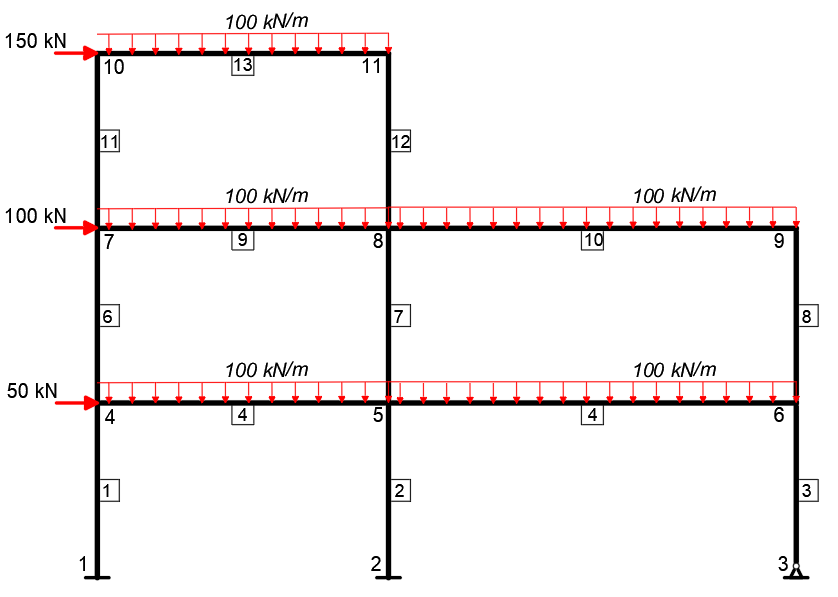

# Material complementario del capítulo de análisis matricial:

En esta carpeta encontrarán varios programas de Matlab que son complementarios a la teoría de los capítulos 14, 15 y 16 del libro de análisis estructural y que pueden ir estudiando a medida que avanzan en el libro: el programa [cercha](./cercha.m) soluciona resuelve la
siguienten cercha:

   

El programa [stiffness_eq_force](./stiffness_eq_force.m) está diseñado para calcular la matriz de rigidez de una viga o las fuerzas nodales
eqivalentes de una fuerza distribuida. El pórtico de la imagen se resuelve con el código [frame](./frame.m)

   

Finalemente, se recomienda estudiar el programa [portico_avanzado](./portico_avanzado.m)

    

