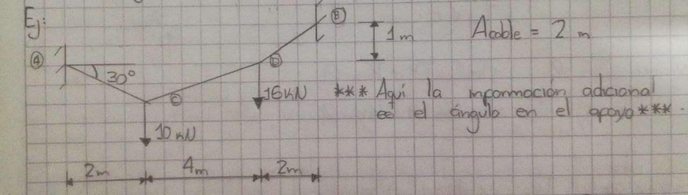

# Material complementario sobre el capítulo de Cables y Arcos:

En esta carpeta encontrarán varios programas de Matlab que son complementarios a la teoría del capítulo 5 del libro de análisis estructural y que pueden ir estudiando a medida que avanzan en el libro: el programa [cables_pointloads](./cables_pointloads.m) soluciona el siguiente ejercicio:

   

El programa [cables_distributed](./cables_distributed.m) soluciona el cable con carga distribuida de la imagen:

   

El programa [arcos](./arcos.m) resuelve el siguiente ejercicio:

   

Además. a continuación se anexa algunos ejercicios numéricos:

## Ejercicios:

Para complementar el libro trabajado en clase, se recomienda resolver los ejercicios del séptimo capítulo del libro Beer and Jhonston entre otros. Varios videos se encuentran en Youtube. A continuación les anexo algunos ejemplos.

**NOTA:**
  Si encuentran otros videos o páginas, que sean muy buenos, con ejercicios enviarmelos al correo para anexarlos