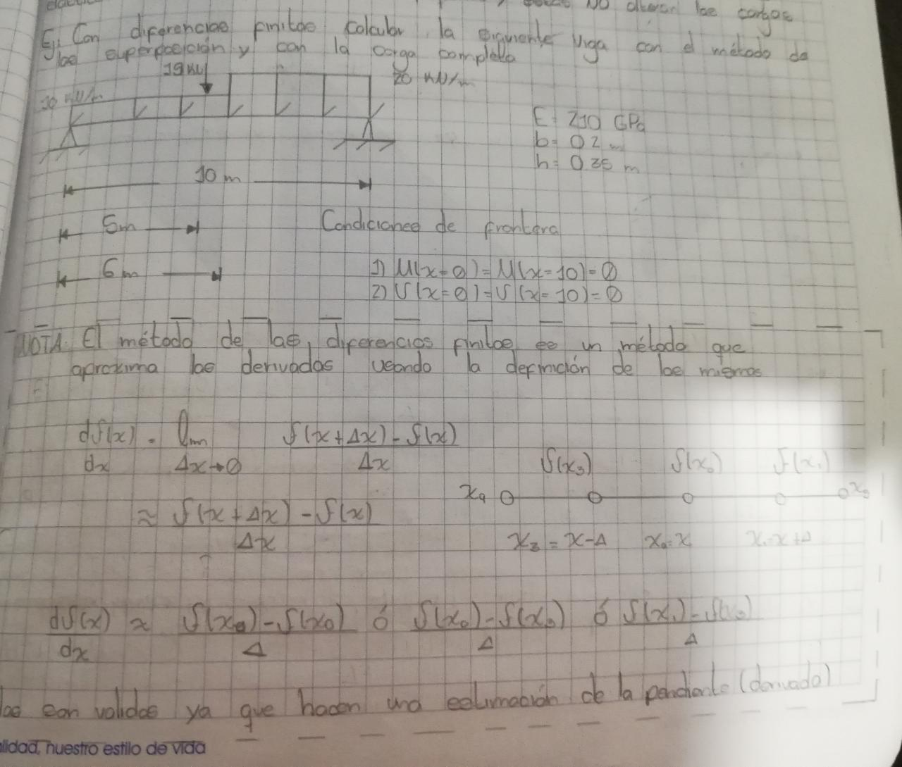
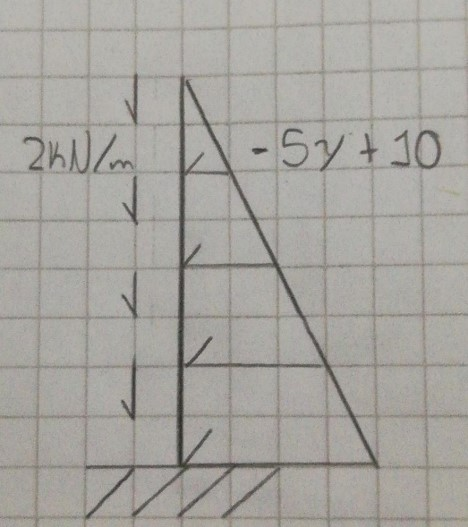
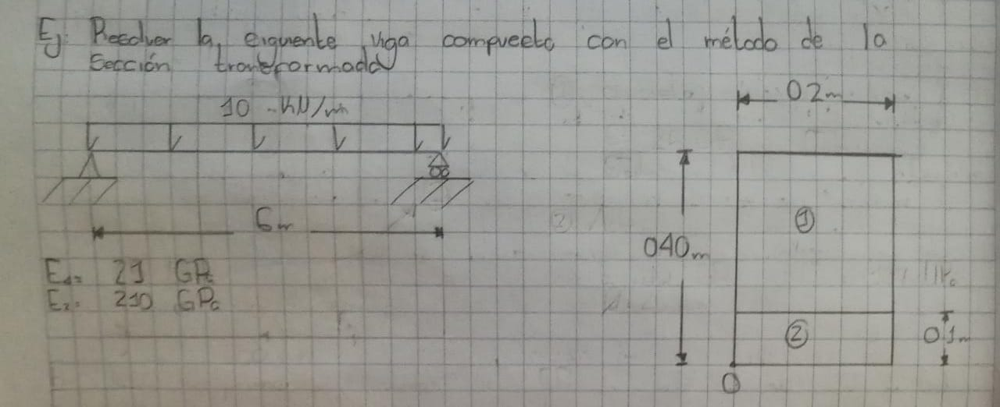
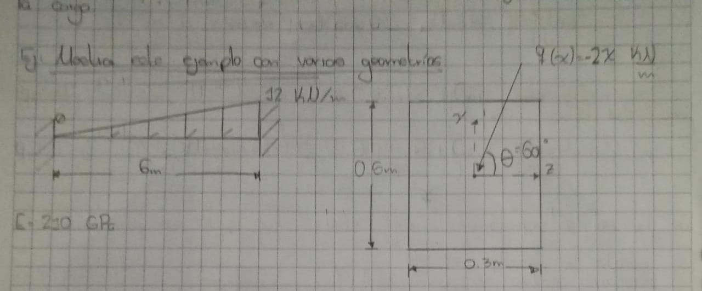

# Material complementario sobre el capítulo de flexión:

En esta carpeta encontrarán varios programas de Matlab que pueden ir estudiando a medida que avanzan en 
el libro; el programa [viga_eb](./viga_EB.m) es complementario al capítulo 5.

El libro de excel [diferencias_finitas](./diferencias_finitas.xlsx) trata el mismo tema del capítulo 9 (sin embargo, recomiendo no estudiarlo. Este se explicará a fondo en clase). Este programa resuelve el siguiente problema:

   

En el código [flexo_compresion](./flexo_compresion.m) se muestra la solución de la siguiente viga:

   

El programa [composite_section](./composite_section.m) soluciona la siguiente viga:

   

El código [biaxial_bending](./biaxial_bending.m) resuelve el siguiente problema: 

   

Los dos últimos programas  son complementarios al capítulo 6.

Además. a continuación se anexa material multimedia sobre los ensayos de flexión de laboratorio típicos
y algunos ejercicios prácticos

## Ensayos de laboratorio:

- Ensayos de flexión:

- Ensayos de cortante: 

## Ejercicios:

 Para complementar el libro trabajado en clase, se recomienda resolver los ejercicios del cuarto y sexto capítulo del libro Beer and Jhonston. Material de apoyo lo encuentran en el siguiente canal de Youtube:  [Resistencia de materiales](https://www.youtube.com/channel/UCkeqD-knV1rd2p2lwXOjrlA).

**NOTA:**
  Si encuentran otros videos o páginas, que sean muy buenos, en los que hallan ensayos o ejercicios enviarmelos al correo para anexarlos