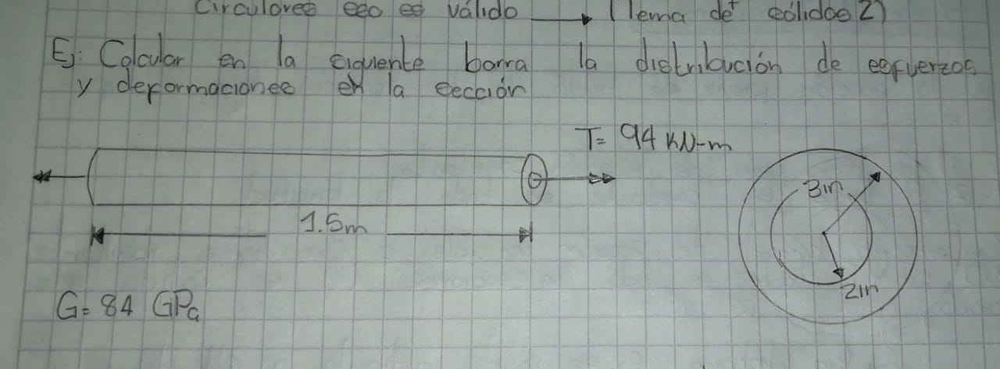
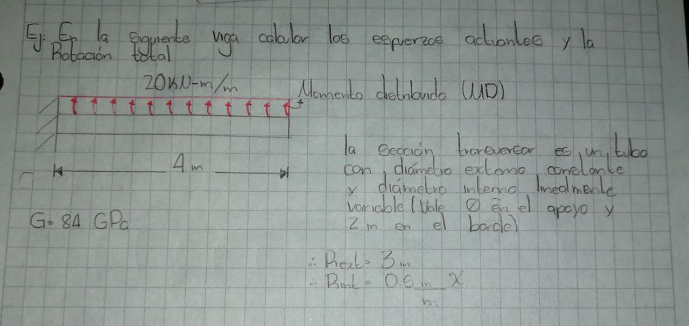
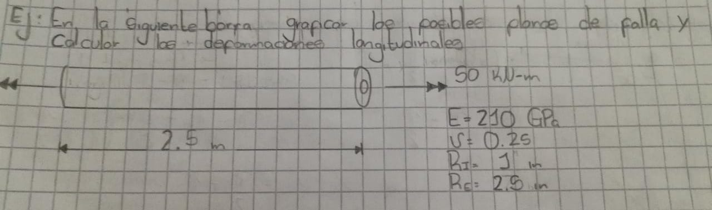

# Material complementario sobre el capítulo de torsión:

En esta carpeta encontrarán varios programas de Matlab que son complementarios a la teoría del capítulo 6 y que pueden ir estudiando a medida que avanzan en el libro: el programa [constant_torsion](./constant_torsion.m) soluciona la siguiente barra:

   

El programa [nonconstant_torsion](./nonconstant_torsion.m) soluciona la siguiente viga:

   

El programa [stress_strains](./stress_strains.m) resuelve el siguiente ejercicio:

   

Además. a continuación se anexa material multimedia sobre varios ensayos de torsión en distintos tipos de materiales y algunos ejercicios prácticos

## Ensayos de laboratorio:

## Ejercicios:

Para complementar el libro trabajado en clase, se recomienda resolver los ejercicios del tercer capítulo del libro Beer and Jhonston. Material de apoyo lo encuentran en el siguiente canal de Youtube:  [Resistencia de materiales](https://www.youtube.com/channel/UCkeqD-knV1rd2p2lwXOjrlA).

**NOTA:**
  Si encuentran otros videos o páginas, que sean muy buenos, en los que hallan ensayos o ejercicios enviarmelos al correo para anexarlos